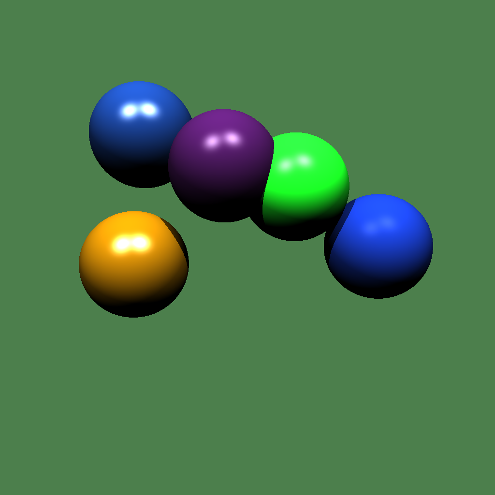

# Трассировка лучей

## Реализация
[Файл с кодом программы](./CudaRuntime4/CudaRuntime4/kernel.cu)

В коды представлены три функции ядра
- `randSpheres` - инициализация сфер на GPU при помощи CUDA
- `randLights` - инициализация света на GPU при помощи CUDA
- `render` - рендер изображения на GPU при помощи CUDA

Так же в коде представлены функции для выполнения на device
- `cast_ray` - запускает луч, из `orgi` в направлении `dir`, возвращает цвет в виде float3, включает рассчет diffuse, specular и теней
- `scene_intersect` - считает пересеченение со всеми сферами на сцене 
- `ray_sphere_intersect` - cчитает пересеченение луча со сферой

Принцип расспараллеливания на CUDA заключался в том, что каждая нить считает значения для своего пикселя, так, каждая нить расчитывает все отражения одного луча, которые соответствует ее пикселю.

## Результаты

## Временя работы GPU
Time GPU (msec): 34.57
### Описание
- **Time GPU (сек)**: Усредненное время выполнения операции на графическом процессоре по 5 запускам.

##
Замеры произоводились на следующей системе:
- **CPU:** Intel(R) Pentium(R) CPU G4600 @ 3.60GHz
- **GPU:** Nvidia GeForce®GTX 1050 Ti 4gb
- **RAM:** 16gb, 2400MHz

